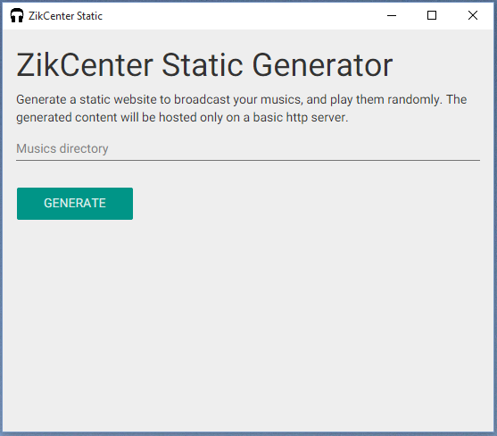

# ZikCenter Static Generator

A software to generate a static website to broadcast your musics, and play them randomly.

The generated content will be hosted only on a basic http server (like [Dropbox](http://ajarproductions.com/blog/2014/06/25/dropbox-as-a-web-server-in-3-easy-steps/), Apache, Nginx).


## Installation

1. [Download](https://github.com/cedced19/zikcenter-static-desktop/releases/latest)
2. Extract
3. Execute `zikcenter-static.exe`



## To compile

```
npm install
gulp dist-win
```
or
```
npm install
gulp
```
